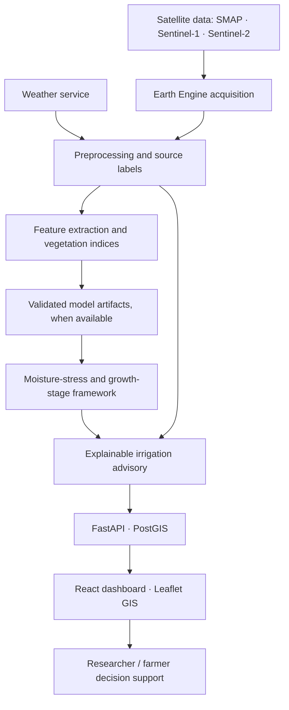

# AgroSense AI — Smart Irrigation Advisory & Soil Moisture Monitoring

**Project:** AI-Driven Automated Crop Type, Moisture Stress Detection and Growth-Stage-Based Irrigation Advisory Using Optical and Microwave Satellite Data.

AgroSense AI is a GIS-oriented research prototype for exploring soil moisture, rainfall, vegetation condition, satellite-derived indices and explainable irrigation decision support for Mehsana, Gujarat. The original Streamlit SMAP forecasting research dashboard remains available as `app.py`; the new React + FastAPI platform lives in `frontend/` and `backend/`.

> **Scientific transparency:** the web platform defaults to `DATA_MODE=REAL` and requests live products from configured providers. Satellite availability depends on Earth Engine authorization, acquisition timing and cloud conditions. SMAP is coarse, regional soil-moisture information—not 10 m or field-scale data. The bundled CSV is available only when explicitly switching to `DATA_MODE=DEMO`; it is synthetic and not a measured observation or validated model prediction.

## Features

- Responsive React + TypeScript dashboard with workspace navigation, demo indicator, presentation mode, accessible controls, map layers, trend chart, CSV export and evidence-based assistant responses.
- Leaflet map with street/satellite basemaps, a coarse regional SMAP soil-moisture raster in real mode, opacity, interactive observation popups and the attributed Mehsana district outline. Crop Monitoring accepts ground-truth crop polygons and trains a Sentinel-2 classifier; the real crop raster remains unavailable until labeled polygons are uploaded and training/evaluation succeeds. Demo crop labels are clearly marked and never stand in for real classifications. The boundary is from DataMeet's Census 2011 district dataset (CC BY 2.5 India), not a surveyed field polygon.
- FastAPI endpoints for study areas, soil moisture, weather, rainfall, vegetation indices, crop/stage/stress status, irrigation advisory, historical observations, fields, analysis, prediction and upload validation.
- Isolated Earth Engine service for NASA SMAP L4, cloud-filtered Sentinel-2 indices (NDVI, NDMI, NDWI, EVI, SAVI) and Sentinel-1 VV/VH microwave backscatter.
- Modular model-loading and feature-engineering scaffolding. Predictions/confidence are unavailable unless matching trained artifacts and metadata are installed.
- PostGIS schema, Docker Compose, environment-variable configuration, OpenAPI docs and CSV/GeoJSON demo examples.

## Architecture



The default real-data path retrieves SMAP L4 observations and Sentinel-1/2 products through Earth Engine, and weather data from Open-Meteo. Configure an Earth Engine project and service-account credentials before starting the backend. Provider failures and missing observations are reported; they are never replaced with demo values. To use the labeled sample dataset for a presentation, explicitly set `DATA_MODE=DEMO`.

## Technology

- **Frontend:** React 18, TypeScript, Vite, Tailwind CSS, Leaflet / React-Leaflet, Recharts, Lucide.
- **Backend:** Python 3.11+, FastAPI, Pydantic, pandas, NumPy, scikit-learn, Earth Engine Python API.
- **Database:** PostgreSQL 16 + PostGIS schema (API demo operates from the sample CSV; database persistence is not yet wired).
- **Data:** NASA SMAP L4 SPL4SMGP/008, COPERNICUS Sentinel-2 Harmonized, Sentinel-1 GRD, Open-Meteo.

## Quick start (Windows PowerShell)

### Backend

```powershell
if (-not (Test-Path .env)) { Copy-Item .env.example .env }
# Set GOOGLE_EARTH_ENGINE_PROJECT and GOOGLE_APPLICATION_CREDENTIALS in .env first.
python -m venv .venv-agrosense
.\.venv-agrosense\Scripts\Activate.ps1
python -m pip install -r backend\requirements.txt
uvicorn app.main:app --app-dir backend --reload --port 8000
```

The API is at `http://localhost:8000`; interactive OpenAPI documentation is at `http://localhost:8000/docs`. `GET /api/health` should report `{"status":"ok","data_mode":"REAL"}`. Earth Engine requests require a valid project and service-account key available to the backend process.

### Frontend

In another PowerShell window:

```powershell
cd frontend
npm install
npm run dev
```

Open `http://localhost:5173`. Vite proxies `/api` requests to `http://localhost:8000`.

### Docker

```powershell
if (-not (Test-Path .env)) { Copy-Item .env.example .env }
# Replace the placeholder Earth Engine project and credential-file path in .env.
docker compose up --build
```

Open the frontend at `http://localhost:3000`, API docs at `http://localhost:8000/docs`, and PostgreSQL/PostGIS at `localhost:5432`. Change `POSTGRES_PASSWORD` before exposing the database outside a trusted development environment. Compose provisions the schema; the current API does not yet store/query its observations through PostgreSQL.

### Tests

```powershell
Set-Location backend
..\.venv\Scripts\python.exe -m unittest discover -s tests -v
```

If using the documented `.venv-agrosense` environment, replace `.venv` in that test command with `.venv-agrosense`.

## Configuration and data modes

Copy `.env.example` to `.env` and set your Earth Engine project and service-account JSON path, or configure the process environment directly. The template selects real mode but contains no credentials. Keep service-account keys private and out of source control. For a clearly labeled synthetic presentation instead, set `DATA_MODE=DEMO`.

| Variable | Purpose |
| --- | --- |
| `DATA_MODE` | `REAL` (default) or `DEMO`. Modes never mix data. |
| `IRRIGATION_STRESS_THRESHOLD`, `IRRIGATION_WATCH_THRESHOLD` | Configurable research-rule thresholds in m³/m³; defaults are illustrative and not locally calibrated. Require `0 <= stress <= watch <= 1`. |
| `DATABASE_URL` | PostgreSQL/PostGIS connection string for future persistence integration. |
| `GOOGLE_EARTH_ENGINE_PROJECT` | Google Cloud / Earth Engine project used by the real SMAP and index services. |
| `GOOGLE_APPLICATION_CREDENTIALS` | Path to a service-account credential file available to the backend process. Never commit that file. |
| `WEATHER_API_KEY` | Reserved for an optional provider; Open-Meteo does not require this key. |
| `GEMINI_API_KEY` | Reserved for a future Gemini integration; currently the assistant is deterministic and application-data-only. |
| `VITE_API_URL` | Optional frontend API origin; leave blank for the Vite proxy or same-origin Docker nginx proxy. |

### Demo mode

Set `DATA_MODE=DEMO` explicitly. Demo mode is self-contained and does not need external credentials. Every record, KPI, chart, marker, assistant explanation and sample advisory is identified as illustrative demo content. Its values are **not** reported as real observations or validated recommendations. Replace `data/sample/demo_soil_moisture.csv` and `data/sample/demo_weather.csv` with clearly documented sample records for a presentation; keep `data_mode=DEMO` and the source label intact.

### Real-data mode

1. Install the backend requirements, enable the Google Earth Engine API for the project and authorize an approved service identity for the required datasets.
2. Set `GOOGLE_EARTH_ENGINE_PROJECT`, `GOOGLE_APPLICATION_CREDENTIALS` and `DATA_MODE=REAL` in `.env`. The service-account file must be readable by the backend. Docker Compose mounts the configured credential file read-only at the path used by the container.
3. Start the backend and verify `GET /api/health` reports `REAL`; `GET /api/live` returns the most recent available SMAP L4 observation. SMAP availability has processing latency; it is not an instantaneous field sensor.
4. `/api/historical` and `/api/soil-moisture` retrieve daily regional SMAP L4 values. `/api/vegetation` returns cloud-filtered Sentinel-2 indices, and `/api/satellite/sentinel-1` returns microwave backscatter only. Raster maps use SMAP for soil moisture and recent 30-day Sentinel-1/2 composites for acquisition-sensitive layers. Empty dates/composites are reported unavailable, not simulated.
5. `/api/weather` queries Open-Meteo archive data and `/api/weather?forecast_days=7` returns a weather forecast when available. Forecasts are uncertain and are not satellite observations.

Missing credentials, unavailable collections and dates without results must be treated as unavailable; do not change to demo mode silently.

## API overview

| Endpoint | Description |
| --- | --- |
| `GET /api/health`, `/api/study-areas` | Service status and configured study area |
| `GET /api/historical?start_date=YYYY-MM-DD&end_date=YYYY-MM-DD` | Date-filtered observation rows; supports `limit` |
| `GET /api/soil-moisture`, `/api/soil-moisture/{date}` | Soil-moisture series, summary or one date |
| `GET /api/weather`, `/api/rainfall` | Weather archive or rainfall rows; real mode supports `forecast_days=1..10` as a separate forecast |
| `GET /api/vegetation`, `/api/ndvi`, `/api/ndmi` | Vegetation-index records |
| `GET /api/satellite/sentinel-1` | VV/VH backscatter; not direct soil-moisture retrieval |
| `GET /api/map/layers/{layer}?observation_date=YYYY-MM-DD` | Date-specific Earth Engine raster tile template for available SMAP, Sentinel-1 or Sentinel-2 layers; demo mode explicitly reports raster tiles unavailable |
| `GET /api/crops/model` | Bundled crop dataset status, class counts, trained class legend and cross-validation summary |
| `POST /api/crops/train-dataset` | Trains an Earth Engine classifier using the bundled Fennel/cotton spectral-feature CSVs |
| `POST /api/crops/train` | Multipart upload (`file`, `start_date`, `end_date`) of ground-truth crop GeoJSON; trains an in-memory Sentinel-2 classifier |
| `GET /api/crops`, `/api/growth-stage`, `/api/moisture-stress` | Labels and model-availability status; no fabricated confidence |
| `GET /api/irrigation-advisory`, `POST /api/advisory` | Explainable rule advisory and explicit limitations |
| `GET /api/fields/{id}` | Demo-only synthetic record; no field boundary is implied |
| `POST /api/analyze` | Evidence-bounded deterministic answer from available records |
| `POST /api/predict` | Explicit model-availability response |
| `POST /api/upload` | CSV/GeoJSON validation preview; uploads are not persisted |

## Earth Engine collections and methods

- **SMAP:** `NASA/SMAP/SPL4SMGP/008`; surface soil moisture is returned at regional scale. It is not described as 10 m or as a field sensor.
- **Sentinel-2:** `COPERNICUS/S2_HARMONIZED`; filters by Mehsana geometry, dates and `CLOUDY_PIXEL_PERCENTAGE < 60`. Index formulas use scaled B2/B3/B4/B8/B11 reflectance.
- **Sentinel-1:** `COPERNICUS/S1_GRD`; IW VV/VH dual-polarization observations. SAR backscatter is not soil moisture unless a separately validated retrieval method is implemented.
- **Crop classifier:** Crop Monitoring includes the supplied Fennel and cotton spectral-feature CSVs under `data/training/`. It uses B2, B3, B4, B5, B6, B7, B8, B8A, B11, B12, NDVI and NDMI to train a Random Forest, reports five-fold stratified record-split metrics, then trains an Earth Engine classifier for an exploratory Sentinel-2 pixel map. The current 97 records have no coordinates/polygons, and the measured 46.4% cross-validation accuracy is below the 51.5% majority-class baseline; the raster is not a field inventory or validated crop map. The trained Earth Engine classifier exists in backend process memory only; restart clears it and requires retraining. Supply independent georeferenced field labels and seasonal validation before operational use.
- **Training endpoint safety:** `POST /api/crops/train` is intended only for a trusted local research deployment. The prototype has no user authentication or authorization; do not expose its model-training endpoint to the public internet.
- The server-side reducers use spatial bounds, daily SMAP aggregation, explicit scales, `maxPixels`, `bestEffort`, `tileScale`, bounded date ranges and capped collection results. Latest live SMAP results are cached for 15 minutes to match the dashboard refresh cadence; other repeated provider requests are cached in process. Do not fetch large image collections with an unbounded client-side `getInfo()`.

## ML model training and evaluation

Model entry points are in `backend/app/ml/`: crop classifier/trainer, moisture-stress classifier, irrigation advisor, time-series placeholder, shared feature engineering and model loader. The supplied crop training CSVs are spectral feature rows with class labels but no geometries; the model's map extrapolates those classes over a recent Sentinel-2 composite and is explicitly exploratory. The current validation score is below its majority-class baseline. No validated stress model or independently validated crop map is bundled. The existing `models/smap_rf_model.joblib` belongs to the separate next-day SMAP workflow and is not silently reused as a crop/stress model.

Evaluation should use a spatially and temporally independent ground-truth validation set. Report accuracy, precision, recall, F1, confusion matrix and Kappa for classification; MAE, RMSE and R² for regression. Do not report a score until calculated on documented validation data.

## Database

`backend/app/database/schema.sql` creates the PostGIS extension and tables for users, study areas, fields, satellite observations, soil moisture, weather, indices, crop classification, growth stages, stress, advisories and predictions. Spatial fields use EPSG:4326 geometry with GiST indexes. Database schema creation is automated by Docker Compose; app persistence, migrations, authorization and row-level access policies remain future integration work.

## Exports and presentation

The dashboard exports visible historical rows as CSV. Use browser print/save-to-PDF for a presentation snapshot. The page includes project/study-area labeling, data mode, source notes, map, metrics, chart and decision-support disclaimer. The report is a presentation aid, not a validated agronomic or regulatory report.

## Limitations and research cautions

1. SMAP spatial resolution is coarse for individual fields.
2. Optical Sentinel-2 observations are affected by clouds and acquisition cadence.
3. SAR interpretation is complex; VV/VH are backscatter, not direct moisture readings.
4. Satellite-derived soil-moisture retrievals require calibration and ground truth.
5. Crop spectral signatures vary by cultivar, management, soil and season.
6. Crop classification and phenological stage require representative georeferenced labels; the supplied crop model is exploratory and scores below its majority-class baseline.
7. Weather estimates and forecasts are uncertain; the current weather API path is historical.
8. Irrigation thresholds need local crop-, soil- and growth-stage calibration.
9. Models may not generalize across locations, seasons or sensors.
10. Irrigation advisory support is not agronomic certainty; verify field conditions.

The map uses the DataMeet India Districts Census 2011 Mehsana boundary (CC BY 2.5 India; see the [source dataset](https://github.com/datameet/maps/tree/b3fbbde595310b397a55d718e0958ce249a4fa1f/Districts/Census_2011)). The map center is 23.59°N, 72.37°E. The boundary is an administrative district outline, not surveyed field geometry, and may not reflect subsequent administrative changes.

## Future scope

- Integrate a managed PostGIS repository, migrations, authentication and per-user study areas.
- Add calibrated field-level products, ground sensors, field polygons and uncertainty-aware raster tiles.
- Train and independently validate crop / stress / growth-stage models using local ground truth.
- Support weather forecasts, probabilistic uncertainty and safe cached provider access.
- Add downloadable evidence reports, model evaluation dashboard, NISAR, drone and IoT workflows.
- Explore yield estimation, water-use optimization, multilingual Gujarati interface and farmer alerts.

## License

Project source code is distributed under the MIT License in `LICENSE`. Dataset, imagery, basemap tile, font and deployment terms remain subject to their respective providers; cite the data providers in research outputs.


## Simplest Render deployment (single service)

This repository can be deployed as one Render Docker web service. The root `Dockerfile` builds the React frontend and serves the compiled frontend from FastAPI, so there is only one public URL and the browser calls `/api/...` on the same origin.

1. Push this folder to a GitHub repository. Do **not** commit `.env` or any Earth Engine JSON credential.
2. In Render, choose **New → Blueprint** and select the repository. Render reads `render.yaml`.
3. During Blueprint setup, provide the requested secret environment values:
   - `GOOGLE_EARTH_ENGINE_PROJECT`: your Earth Engine-enabled Google Cloud project ID.
   - `WEATHER_API_KEY`: leave blank if using the configured Open-Meteo path.
   - `GEMINI_API_KEY`: leave blank unless a future Gemini integration is enabled.
4. After the service is created, open **Environment → Secret Files → Add Secret File**.
   - Filename: `earthengine-key.json`
   - Contents: paste the service-account JSON file used for Earth Engine.
5. Render exposes the secret file to the Docker service at `/etc/secrets/earthengine-key.json`. The Blueprint already sets `GOOGLE_APPLICATION_CREDENTIALS` to that path.
6. Deploy. The health check is `/api/health`; the dashboard and API are served from the same `onrender.com` URL.

For local development, keep using the existing two-terminal workflow. For the hosted build, `VITE_API_URL` should remain blank so the frontend uses the same-origin `/api` path.

### Security note

The local `.env` file must never be committed. If a real API key has ever been placed in a shared file, chat, screenshot, or Git repository, revoke/rotate that key before publishing the project and create a replacement in the hosting provider's secret settings.
